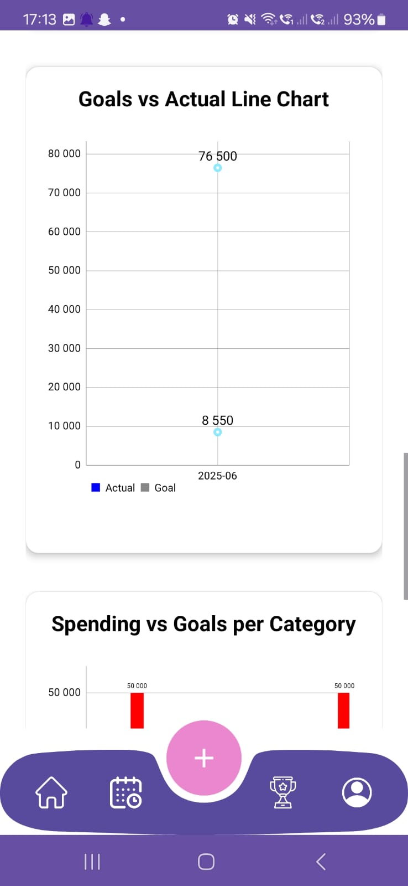
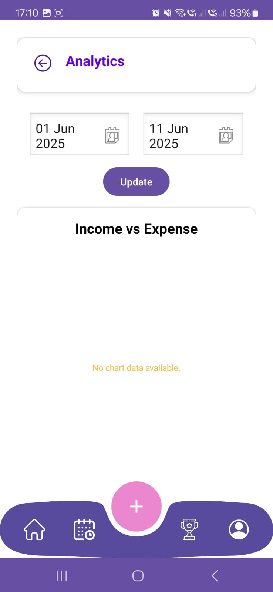
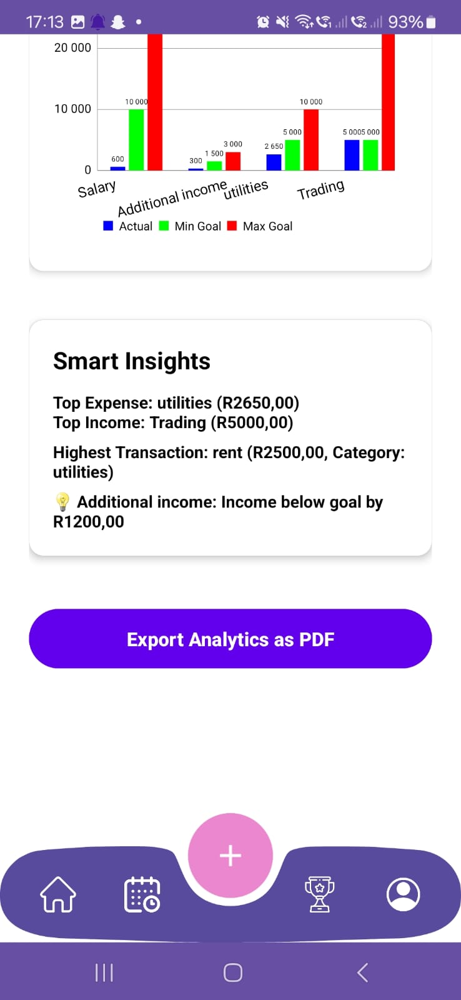

<div align="center">

<h1>💰📱 Thryft Budget App 📱💰</h1>

<h2>


</h3>

</div>


**🎓 Institution:** IIE Varsity College Westville  

</div>

---
## 📑 Table of Contents

1. ✨ Introduction  
2. 🌟 Purpose  
3. 🎨 Design Decisions  
4. 🤖 GitHub Actions  
5. 💻 Setting Up the Project Locally & Usage  
6. ✅ Requirements and Features  
7. ⚙️ Functionality  
8. 🖼️ Image Assets  
9. 🏠 Architecture  
10. 🗒️ Change Log  
11. 👥 Authors & Contributors  
12. ⚖️ MIT License  
13. ❓ Frequently Asked Questions (FAQ)  
14. 🔗 Links  
15. 📱 App APK  
16. 📚 References  

---
## ✨ 1. Introduction

The **Thryft Budget App** is an online mobile application built using **Kotlin** and **Android Studio**. It is designed to empower individuals with meaningful insights into their spending and saving habits, providing a structured yet flexible interface for managing daily finances.

This application is centered around the core principles of budgeting — planning income, tracking expenses, comparing against limits, and ultimately helping users stay financially healthy. In its current prototype, the app stores data locally using **RoomDB**, offering full functionality without requiring internet access.

Firebase integration for cloud sync and authentication is prepared and will be introduced in future updates.

---
## 🌟 2. Purpose

The purpose of the **Thryft Budget App** is to create a **user-friendly, engaging mobile application** that helps users manage their personal finances effectively.  
The app simplifies budgeting by tracking spending habits, setting savings goals, and monitoring progress in an intuitive way.  
Gamification elements make budgeting fun, rewarding, and engaging.

**Core objectives:**
- 🔐 Secure registration & login with Firebase Auth  
- 📂 Categorized expenses (Groceries, Entertainment, etc.)  
- ✏ Add transaction details (amount, description, type, category, optional photo)  
- 🎯 Monthly and category-specific budgets  
- 📊 Visual dashboard with budget progress  
- 📈 Spending trend graphs  
- 🏆 Gamification rewards  
- ☁ Online storage in Firebase Firestore for cross-device access  

---
## 🎨 3. Design Decisions

### UI Design
- 🎯 Intuitive layout  
- 🚫 Error handling for invalid inputs  
- 🏆 Gamification badges  
- 📊 Visual feedback with graphs  

### Functionality
- 📈 Graphs for daily spending  
- 📊 Progress dashboards  
- ☁ Firebase for online storage  
- 🌓 Dark/Light mode  

### UX Considerations
- 😌 Stress-free experience  
- 🖼 Receipt image attachments  

---
## 🤖 4. GitHub Actions

```yaml
name: Android Build

on:
  push:
    branches: [ main ]
  pull_request:
    branches: [ main ]

jobs:
  build:
    runs-on: ubuntu-latest

    steps:
    - name: Checkout Repository
      uses: actions/checkout@v3

    - name: Set up JDK 17
      uses: actions/setup-java@v3
      with:
        distribution: 'temurin'
        java-version: '17'

    - name: Give gradlew permission
      run: chmod +x ./gradlew

    - name: Build Debug APK
      run: ./gradlew assembleDebug
```

📷 **Screenshots:**

<table>
  <tr>
    <td></td>
    <td></td>
  </tr>
</table>

---
## 💻 5. Setting Up the Project Locally & Usage

**Prerequisites:**
- 🛠 Android Studio IDE  
- ☕ JDK 17+  
- 📝 Kotlin 1.8+  
- ⚙ Gradle 8.0+  
- 📱 Android 7.0+ device/emulator  
- 🌐 Internet (for Firebase setup)  

**Installation Steps:**
1. 📥 Clone repo  
2. 📂 Open in Android Studio  
3. 🔄 Sync Gradle  
4. ▶ Run app  
5. 📄 Add `google-services.json` if needed  

**Usage:**
- ➕ Add income/expenses  
- 📂 Create categories/budgets  
- 📊 View analytics  
- 📄 Export PDFs  
- 🌓 Toggle dark/light mode  

---
## ✅ 6. Requirements and Features

**Non-Functional:**  
- 🔐 Firebase Auth & Firestore  
- ⚡ Smooth performance  
- 📈 Scalable architecture  
- 📱 Android 7.0+ compatibility  
- 🛠 Modular code  
- 🎨 User-friendly UI  

**Required Functionalities:**  
- 📊 Line graph (Goal vs Actual)  
- 📊 Triple bar graph (Income, Expense, Actual)  

**Extra:**  
- 🥧 Pie chart (Income vs Expense)  
- 🤖 Smart insights (Top spend/income)  

---
## ⚙️ 7. Functionality
- ➕ Add/delete transactions  
- 🏷 Assign icons to categories  
- 📸 Attach receipt images  
- 📅 Summarized by date/category  
- 📊 Graphs  
- 📄 PDF export  
- 🔍 Search/filter  
- 🌓 Dark/light mode  
- ☁ Firebase integration  

---
## 🖼️ 8. Image Assets

<table>
  <tr>
    <td></td>
    <td></td>
    <td></td>
  </tr>
  <tr>
    <td></td>
    <td></td>
    <td></td>
  </tr>
  <tr>
    <td></td>
    <td></td>
    <td></td>
  </tr>
  <tr>
    <td></td>
    <td></td>
    <td></td>
  </tr>
</table>

---
## 🏠 9. Architecture
- 🏛 MVVM  
- 🗄 Room DB Entities + DAOs  
- 🖼 Activities & Fragments  
- 🧠 ViewModel with LiveData  

---
## 🗒️ 10. Change Log
- ➕ Added graphs, dashboard  
- 🌓 Added Dark Mode  
- ☁ Upgraded to Firebase Firestore  

---
## 👥 11. Authors & Contributors
 👨‍💻 Braden Caleb Perumal (ST10287165)  
  📧 **Email:** [calebperumal28@gmail.com](mailto:calebperumal28@gmail.com)


---
## ⚖️ 12. MIT License
- ThryftBudgetApp is licensed under the MIT License. You are free to use, modify, and distribute the project with proper credit.


---
## ❓ 13. Frequently Asked Questions (FAQ)
- ❓ Can I register or log in? → Not yet, coming soon  
- ❓ How do I know if I’ve overspent? → Progress bar turns red  
- ❓ Can I search transactions? → Yes, by keyword/date/type  
- ❓ Where are images stored? → Locally via URI  

---
## 🔗 14. Links
- 📂 [GitHub Repository](https://github.com/VCWVL/prog7313-poe-CalebPerumal28.git)  

---
## 📱 15. App APK
- 📂 [APK Repo](https://github.com/VCWVL/prog7313-poe-CalebPerumal28.git)  

---
## 📚 16. References  

- 📺 **BroCode** – *Android Development for Beginners* – [YouTube Channel](https://www.youtube.com/@BroCodez) *(Accessed: 2 May 2025)*  

- 📊 **PhilJay** – *MPAndroidChart* – [GitHub Repository](https://github.com/PhilJay/MPAndroidChart) *(Accessed: 2 May 2025)*  

- 📘 **JetBrains** – *Kotlin Language Documentation* – [KotlinLang.org](https://kotlinlang.org/docs/home.html) *(Accessed: 2 May 2025)*  

- 🗄 **Android Developers** – *Room Persistence Library* – [Documentation](https://developer.android.com/jetpack/androidx/releases/room) *(Accessed: 2 May 2025)*  

- 📄 **Android Developers** – *PdfDocument API* – [Documentation](https://developer.android.com/reference/android/graphics/pdf/PdfDocument) *(Accessed: 2 May 2025)*  

- 🧠 **Android Developers** – *ViewModel Overview* – [Documentation](https://developer.android.com/topic/libraries/architecture/viewmodel) *(Accessed: 2 May 2025)*  

- 💬 **Stack Overflow** – *Developer Community* – [Website](https://stackoverflow.com/) *(Accessed: 2 May 2025)*  

- 🎨 **Kusnier, J.** – *Liquid Bottom Navigation UI Design in Jetpack Compose* – [YouTube Video](https://youtu.be/nP42CBV5Rd0) *(Accessed: 2 May 2025)*  

