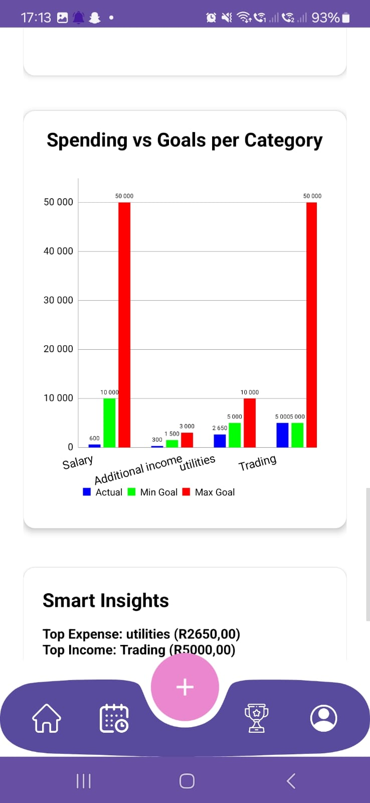
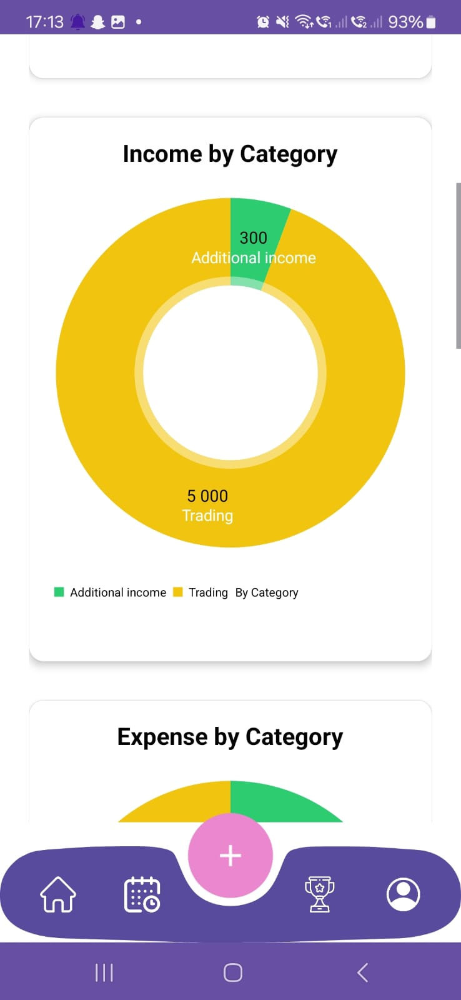

# 💰📱 Thryft Budget App

Module Name: Programming 3A [PROG7311]
Assessment Type: PoE - Part 3 (Final)
IIE Varsity College Westville

GitHub Repository: https://github.com/VCWVL/prog7313-poe-CalebPerumal28.git
Thryft Budget App APK Repository: https://github.com/CalebPerumal28/ThryftAppBuildApkPOE.git
Video Demonstration (OneDrive): 

## 📑Table of Contents

1. Introduction
2. Purpose
3. Design Decisions
4. GitHub Actions
5. Setting Up the Project Locally & Usage
6. Requirements and Features
7. Functionality
8. Image Assets
9. Architecture
10. Change Log
11. Authors & Contributors
12. MIT License
12. Frequently Asked Questions (FAQ)
14. References

## ✨ 1. Introduction

The Thryft Budget App is an online mobile application built using Kotlin and Android Studio. It is designed to empower individuals with meaningful insights into their spending and saving habits, providing a structured yet flexible interface for managing daily finances.

This application is centered around the core principles of budgeting — planning income, tracking expenses, comparing against limits, and ultimately helping users stay financially healthy. In its current prototype, the app stores data locally using RoomDB, offering full functionality without requiring internet access.

Firebase integration for cloud sync and authentication is prepared and will be introduced in future updates.

## 🎯 2. Purpose

The purpose of the Thryft Budget App is to create a user-friendly, engaging mobile application that helps users manage their personal finances effectively. The app aims to simplify the often tedious and stressful task of budgeting by allowing users to track their spending habits, set savings goals, and monitor their financial progress in an intuitive and enjoyable way. A key focus is incorporating gamification elements to make the budgeting process fun and rewarding, encouraging consistent use. The app is designed to assist users in categorizing expenses, setting budgets, visualizing spending trends, and storing data both locally and online for accessibility across devices.

### - Core objectives:

-- Enable users to register and log in securely with a email and password, using Firebase Auth.
-- Allow users to create and categorize expenses (e.g., "Groceries," "Entertainment," "Transport").
-- Support entry with details such as amount, description, transaction type (e.g. toggle between income or expense), category, and optionally add a photo from gallery or camera.
-- Facilitate the setting of monthly budget goals and category-specific limits.
-- Provide a visual dashboard to track progress against budget goals, highlighting overspending.
-- Display spending trends through graphs for user-selectable periods.
-- Incorporate gamification features like rewards or badges for meeting budget goals or consistent logging.
-- Store data in an online database Firebase (Firestore DB) for the final submission to enable cross-device access.

## 🎨 3. Design Decisions 

The design decisions for the app are informed by the research, planning, and implementation requirements. These decisions aim to ensure functionality, usability, and engagement while adhering to the technical and academic requirements of the course. 

### Key design decisions:

- User Interface (UI) Design
-- Intuitive and Engaging Layout: The UI is designed to be appealing and easy to navigate, addressing the perception that budgeting is tedious. Consistent use of layouts, fonts, and colors ensures a cohesive and professional look. The design incorporates clear navigation paths, with mockups for each screen and a diagram outlining screen transitions to guide users seamlessly through tasks like logging in, adding expenses, or viewing reports.
-- Error Handling: The app is built to handle invalid user inputs gracefully without crashing, ensuring a robust user experience. For example, input validation is implemented for fields like expense amounts and dates.
-- Gamification Elements: To make budgeting engaging, the app includes gamification features such as badges or rewards for meeting budget goals or logging expenses consistently. These elements are designed to motivate users and make the app more interactive.
-- Visual Feedback: The app includes a progress dashboard that visually highlights overspending categories (e.g., using red indicators) and displays spending trends via graphs. This ensures users can quickly understand their financial status and identify areas for improvement.

- Functionality and Features
-- Graphical Representation: A graph displays daily spending by category over a user-selectable period, with clear indicators for budget goals (minimum and maximum).
-- Progress Dashboard: A visual dashboard shows how well users are staying within their budget, with overspending categories highlighted.
-- Online Database: Data is stored in an online database (e.g., Firebase) to allow access across multiple devices, ensuring seamless user experience.
-- Custom Features: At least two unique features are included, as outlined and documented in the README file, to enhance the app’s functionality and creativity.

- User Experience Considerations
-- The app is designed to be appealing and intuitive, with a focus on reducing the stress associated with budgeting. Features like gamification and visual dashboards make the app engaging and easy to use.
-- The UI is consistent, with clear navigation and error handling to prevent crashes, ensuring a smooth experience even for non-technical users.
-- The ability to attach receipt photos and access them from the expense list adds practical value, making the app useful for real-world budgeting scenarios.

## 🤖 4. GitHub Actions

```
name: Android Build

on:
  push:
    branches: [ main ]
  pull_request:
    branches: [ main ]

jobs:
  build:
    runs-on: ubuntu-latest

    steps:
    - name: Checkout Repository
      uses: actions/checkout@v3

    - name: Set up JDK 17
      uses: actions/setup-java@v3
      with:
        distribution: 'temurin'
        java-version: '17'

    - name: Give gradlew permission
      run: chmod +x ./gradlew

    - name: Build Debug APK
      run: ./gradlew assembleDebug
```


## 💻 5. Setting Up the Project Locally & Usage

### Prerequisites:

- Android Studio IDE
- JDK 17+
- Kotlin 1.8+
- Gradle 8.0+
- Android device or emulator with Android 7.0 (API 24) or higher
- Internet connection (only required for future Firebase functionality)

### Installation Steps: 

1. Clone or download the repository
2. Open it using Android Studio
3. Allow Gradle to sync all dependencies
4. Run the application on an emulator or connected via USB debugging to an Android device
5. (Optional) Place `google-services.json` in the app folder for future Firebase setup

### How to Use

1. Once the app is running on an emulator or on an Android device using USB debugging
2. Add your income and expenses using the "Add" button
3. Set up categories with names, icons, and optional budget caps
4. Navigate to the Analytics screen to view spending summaries
5. Tap Export to save a monthly financial PDF
6. Use Profile to toggle dark mode or manage notifications

### Plugins

- MPAndroidChart: Utilized for rendering visual charts, such as the graph showing daily spending by category over a user-selectable period. This plugin enables the creation of clear, interactive visualizations to display spending trends and budget goals, fulfilling the final PoE requirement for graphical data representation.
- Android-Iconics: Employed to integrate Material Design icons into the app’s user interface. It enhances the visual appeal and consistency of the UI by providing scalable, customizable icons for elements like buttons, menus, or gamification badges, aligning with the requirement for an intuitive and engaging design.
- PdfDocument: Used for exporting data, such as expense reports or budget summaries, to PDF format. This plugin supports potential additional features (e.g., allowing users to save or share reports), enhancing the app’s functionality beyond the minimum requirements.
- Firebase: Used for online database storage and user authentication. It enables data synchronization across devices and secure login functionality, meeting the requirement for online data storage.
- IconsDrawable: The IconicsDrawable class is part of the Android-Iconics library, and it's used render vector-based icons from icon fonts (like FontAwesome), customize icon size, color, padding, and contours programmatically, avoid using .png images by replacing them with scalable font-based icons.

## ✅ 6. Requirements and Features

### Non-Functional Requirements:
- Security: Firebase Auth and Firestore data storage
- Performance: Smooth rendering and fast database operations
- Scalability: Firebase integration planned for future updates
- Compatibility: Works across Android 7.0+ devices
- Maintainability: Code is modular and structured for team collaboration
- Usability: Intuitive user interface with visual feedback and clear navigation

### (PoE Final) Required Functionalities:
- Line graph showing goal expenditure vs actual expenditure 
- Triple bar graph showing actual, income and expense per category

### 2 Required Additional Features:
- Export transactions and analytics
- Light mode and dark mode

### Non-Required Additional Features:
- Pie chart for income vs expense
- Pie Chart for income by category
- Filter expense by category 
- Bar graph for income vs expense
- Smart Insights: Top expense, top income, highest transaction 

## ⚙️ 7. Functionality

- Add and delete income or expense transactions
- Assign categories with icons and custom budget limits
- Attach images (receipts or notes) to transactions
- View category-wise and date-wise financial summaries
- Pie and bar charts for visual data representation
- Export monthly statements as PDFs
- Toggle dark/light mode and manage notification settings
- Advanced transaction search by keyword, date, or type
- View progress bars indicating budget usage per category
- Online storage using Firebase Firestore
- Authencation with email and password using Firebase authentication

## 🖼️ 8. Image Assets








## 🏗️ 9. Architecture

Thryft follows the MVVM (Model-View-ViewModel) architecture for a clean separation of concerns and scalability:
- Model: Contains Room entities, data classes, and DAOs
- View: Activities and fragments display data and capture user input
- ViewModel: Manages business logic and LiveData for the UI

All transaction and category data is stored and queried through RoomDB. PDF export, image handling, and charts are all implemented on-device.

### 📝 10. Change Log

## New Features Added:
- Graph for Spending Trends: A graph showing the amount spent per category over a user-selectable period, with indicators for minimum and maximum budget goals.
- Progress Dashboard: A visual display showing how well the user is staying within their minimum and maximum spending goals for the past month, with overspending categories highlighted.
- Custom Features: At least two unique features, as described in the design document. These two are: export transactions and analytics and light mode and dark mode UI.

### Data Storage Upgrade: 
- Firebase Firestore: Database is now fully online making use of Firebase Firestore instead of RoomDB.

## 👥 11. Authors & Contributors

- Braden Caleb Perumal (ST10287165)
- Nikhile Reddy (ST10338305)
- Ishkar Singh (ST10395002)
- Abdul Basit Shahid Deshmukh (ST10316123)

We are the sole authors of the Thryft Budget App.
Please email dbw@varsitycollege.co.za or, alternatively StudentServicesWVL@varsitycollege.co.za for any inquiries or concerns.

### Reporting Issues: 
- Any bugs, glitches can be reported using the GitHub repository, provided with detailed information about the issue, how it arises, any error message etc. - Screenshots if applicable
Proposing Enhancements: 
- Suggestions are welcome and may be proposed on the GitHub repository - open to discussion.
Submitting Pull Requests: 
- Submit a pull request (PR) on the GitHub repository. 
- Fork the repository, create a new branch for your changes, and commit your modifications with clear and concise commit messages. 
- Ensure that your code adheres to the project's coding standards and follows best practices. 
- Provide a detailed description of your changes in the pull request, explaining the problem you're addressing and the solution you've implemented.

## ⚖️ 12. MIT License

Copyright (c) 2025 Thryft Budget App

Permission is hereby granted, free of charge, to any person obtaining a copy
of this software and associated documentation files (the "Software"), to deal
in the Software without restriction, including without limitation the rights
to use, copy, modify, merge, publish, distribute, sublicense, and/or sell
copies of the Software, and to permit persons to whom the Software is
furnished to do so, subject to the following conditions:

The above copyright notice and this permission notice shall be included in all
copies or substantial portions of the Software.

THE SOFTWARE IS PROVIDED "AS IS", WITHOUT WARRANTY OF ANY KIND, EXPRESS OR
IMPLIED, INCLUDING BUT NOT LIMITED TO THE WARRANTIES OF MERCHANTABILITY,
FITNESS FOR A PARTICULAR PURPOSE AND NONINFRINGEMENT. IN NO EVENT SHALL THE
AUTHORS OR COPYRIGHT HOLDERS BE LIABLE FOR ANY CLAIM, DAMAGES OR OTHER
LIABILITY, WHETHER IN AN ACTION OF CONTRACT, TORT OR OTHERWISE, ARISING FROM,
OUT OF OR IN CONNECTION WITH THE SOFTWARE OR THE USE OR OTHER DEALINGS IN THE
SOFTWARE.

##❓ 13. Frequently Asked Questions (FAQ)

### (1) Can I register or log in?**
Not yet. Firebase Authentication will be added in future versions.

### (2) How do I know if I’ve overspent?**
Category progress bars will indicate when you’ve exceeded your defined budget.

### (3) Can I search for specific transactions?**
Yes. You can search by description, type, or date range in the advanced search.

### (4) Where are my attachments stored?**
Images are saved locally on the device and linked by URI.

## 📚 14. References

BroCode, n.d. Android Development for Beginners. [online] YouTube. Available at: https://www.youtube.com/@BroCodez [Accessed 2 May 2025].

PhilJay, n.d. MPAndroidChart. [online] GitHub. Available at: https://github.com/PhilJay/MPAndroidChart [Accessed 2 May 2025].

JetBrains, n.d. Kotlin Language Documentation. [online] KotlinLang.org. Available at: https://kotlinlang.org/docs/home.html [Accessed 2 May 2025].

Android Developers, n.d. Room Persistence Library. [online] Available at: https://developer.android.com/jetpack/androidx/releases/room [Accessed 2 May 2025].

Android Developers, n.d. PdfDocument API. [online] Available at: https://developer.android.com/reference/android/graphics/pdf/PdfDocument [Accessed 2 May 2025].

Android Developers, n.d. ViewModel Overview. [online] Available at: https://developer.android.com/topic/libraries/architecture/viewmodel [Accessed 2 May 2025].

Stack Overflow, n.d. Stack Overflow: Developer Community. [online] Available at: https://stackoverflow.com/ [Accessed 2 May 2025].
